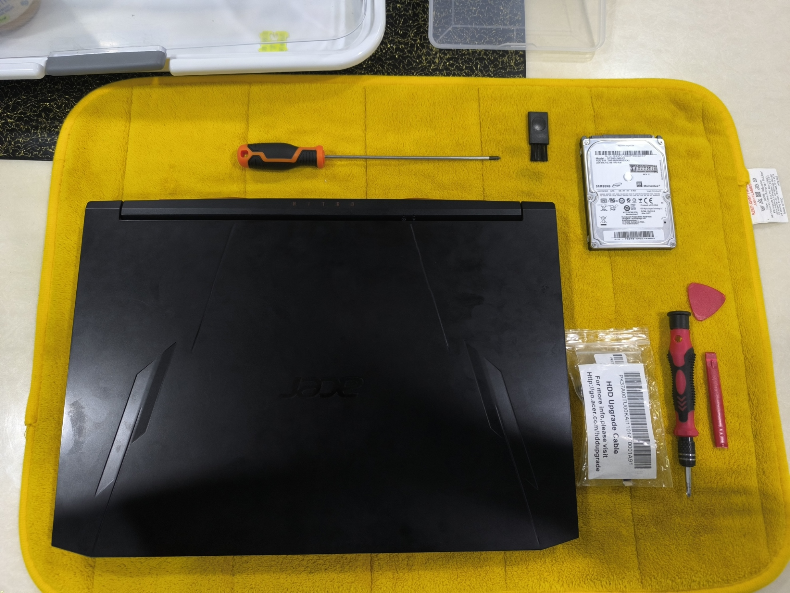
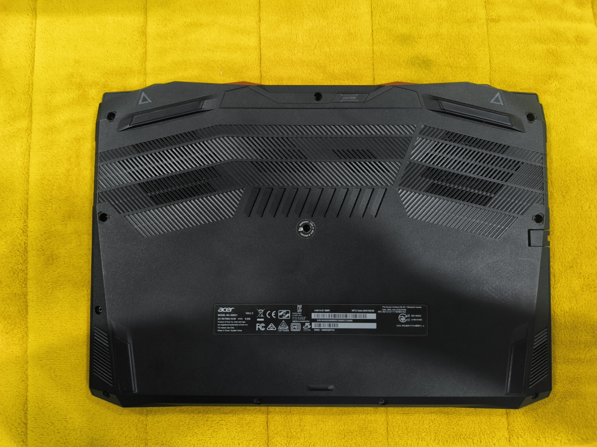
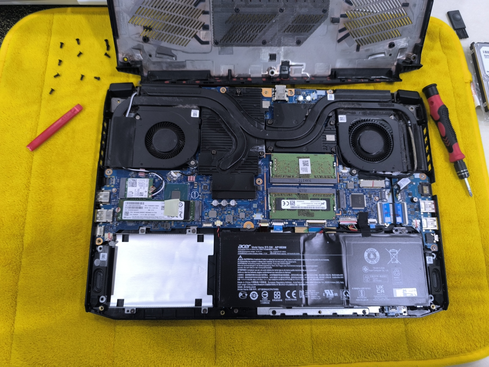
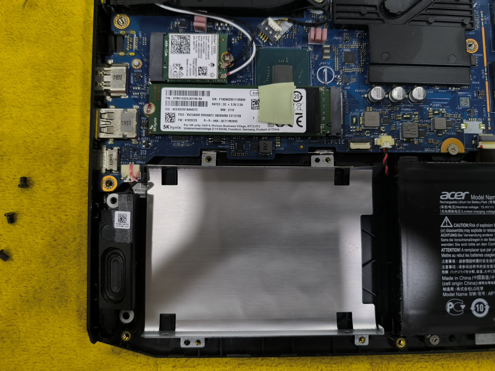
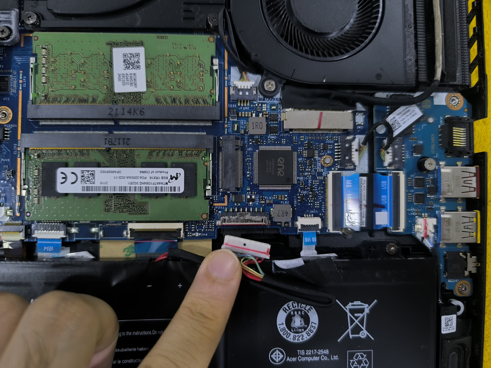
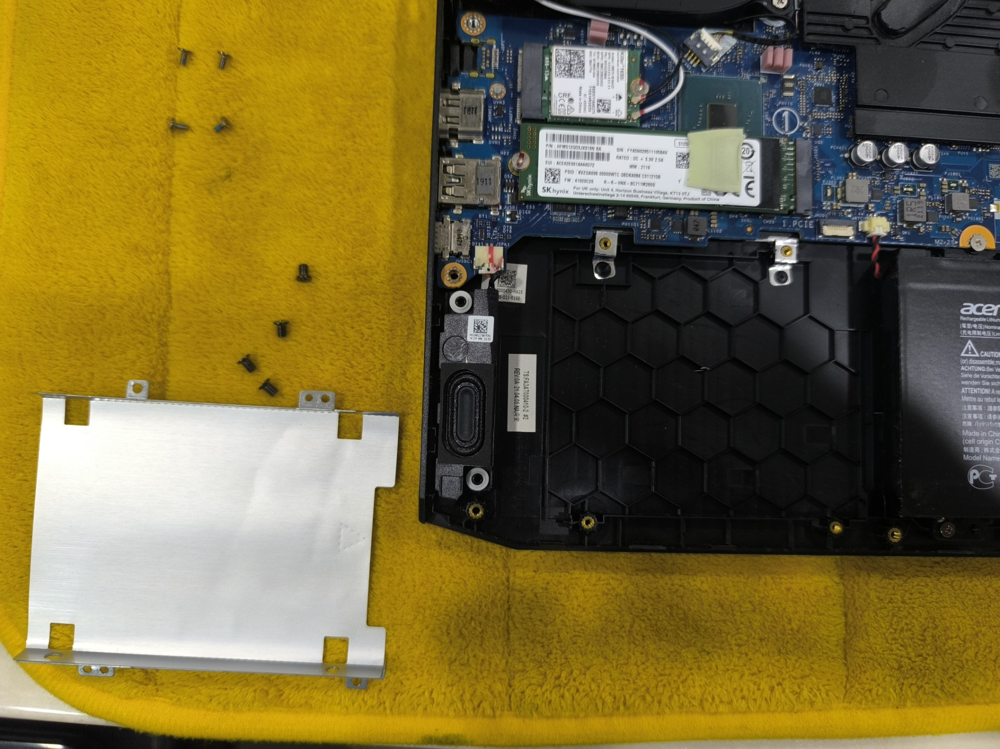
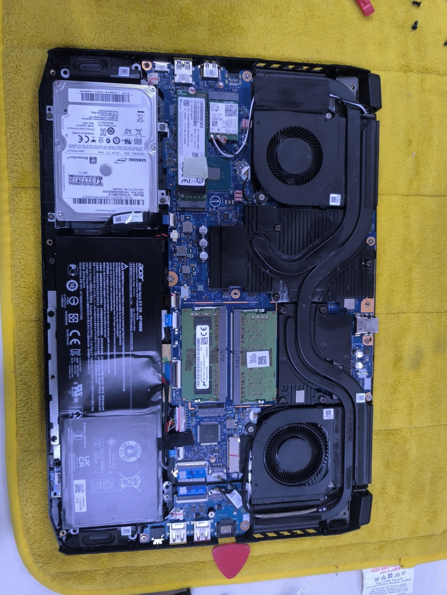
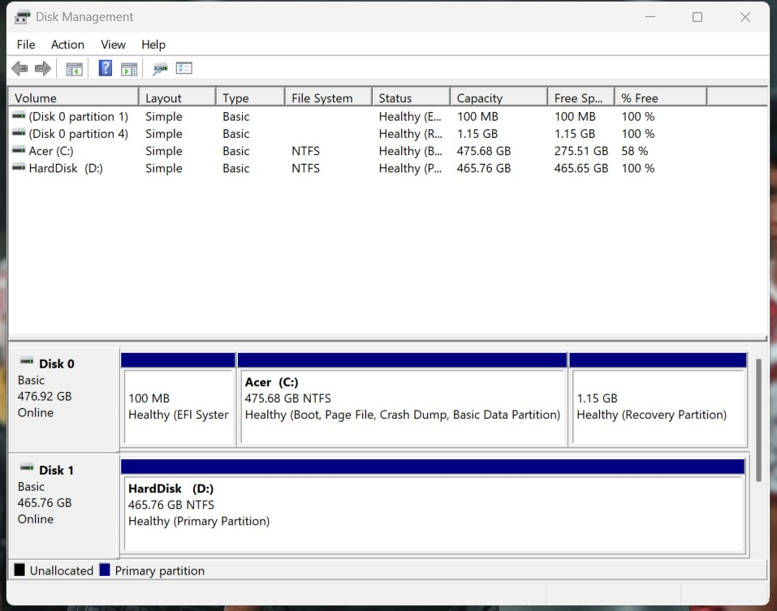
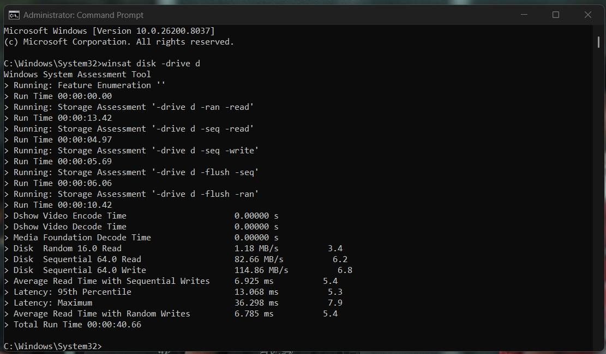

# Acer Nitro 5 (AN515-57) Storage Upgrade 🛠️

A step-by-step documentation of a hardware storage upgrade on an Acer Nitro 5 gaming laptop. This project demonstrates practical hardware handling, system disassembly, component installation, and software-level disk initialization.

## 📋 Project Overview
* **Device:** Acer Nitro 5 (AN515-57)
* **Component Installed:** 512GB Seagate 2.5" HDD
* **Objective:** Safely expand internal storage capacity while maintaining system integrity and testing post-installation performance.

## 🧰 Tools & Components
* Seagate 512GB 2.5" Hard Disk Drive
* Acer HDD Upgrade Cable (Proprietary SATA connector)
* Precision Screwdriver Set
* Plastic Prying Tools (Spudger/Picks)
* Anti-static mat/surface

---

## ⚙️ Installation Process

### 1. Chassis Disassembly
Carefully removed the bottom casing screws and used a plastic prying tool to detach the back cover without damaging the retention clips.

### 2. Component Preparation
Prepared the empty 2.5" drive bay by removing the aluminum mounting caddy. 

### 3. Battery Disconnection
Crucial safety step: disconnected the internal battery connector from the motherboard to eliminate any electrical current flowing through the system during the upgrade process. This prevents accidental short-circuiting when working near components like the RAM and HDD slot.

### 4. HDD Mounting and Cable Routing
Mounted the Seagate HDD into the caddy and secured it back into the chassis. Connected the proprietary Acer HDD upgrade cable to the drive.

### 5. Motherboard Connection
Delicately routed the SATA ribbon cable and seated the connector into the motherboard's HDD port, ensuring the locking mechanism was fully secured to prevent data corruption from a loose connection.

### 6. Reassembly
Reattached the bottom chassis, ensuring all clips snapped back into place and all screws were re-seated firmly.

---

## 💻 System Configuration & Benchmarking

After physically installing the drive, the system required software-level configuration to recognize and utilize the new hardware.

### Disk Initialization
Booted into Windows and used **Disk Management** to initialize the new disk, allocate the unallocated space, and format it as a New Simple Volume (NTFS). The system successfully recognized the drive as "HardDisk (D:)" with 465.76 GB of usable space.

### Performance Testing
Ran a command-line storage assessment using the Windows System Assessment Tool (`winsat`). 
* **Command used:** `winsat disk -drive d`
* Verified standard mechanical drive read/write speeds, confirming the SATA connection was stable and functioning optimally.

---
*Documented for portfolio purposes to demonstrate practical hardware integration and system management.*
